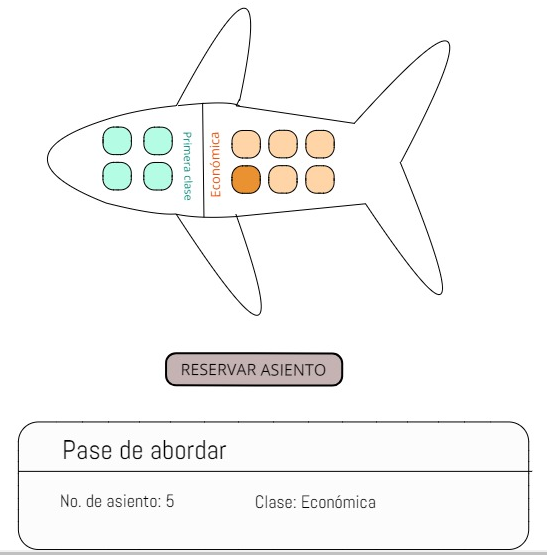

# **Reserva de puestos Aerolínea**
------

- ### **Objetivo**

Desarrollar un sistema que expida reservaciones automatizadas de los asientos en una aerolínea.

*Zonas de distribución de asientos:* 
- First Class
- Economic Class.

*Número de asientos:* 10.

